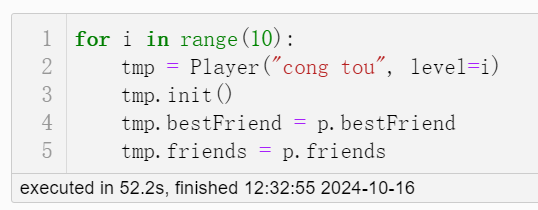
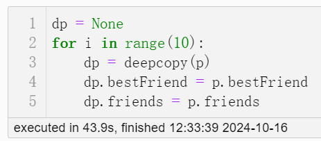
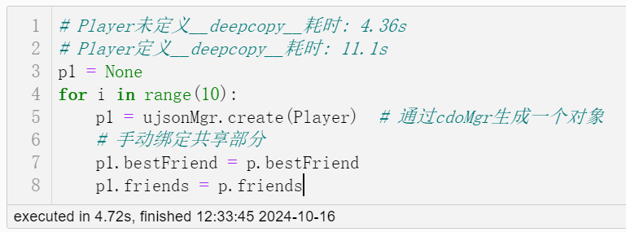
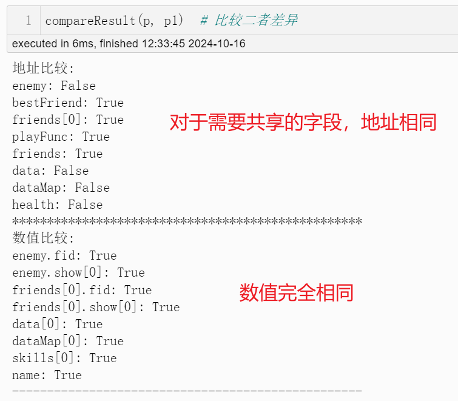

# PyQC
Python Quick Construct！

* 通过简易的API和一些类定义规则，便能够加速对象的构建；
* 相较于对象池，更节省内存，这一点在大对象上更显著。全局仅存在一份对象模板，需要时从模板拷贝构建，不存在像对象池一样预创建实例；
* Python层面的优化，不涉及解释器

# 一、效果

## 性能比较

测试环境：

* 硬件信息：i7-12700H、RTX3070Ti Laptop，Samsung 16GB x 2，DP充电器（功率最大135W）
* 软件信息：Python2.7 + Jupyter Notebook

规则：数据规模n取`100000`，以构建`10`个Player对象的速度为基准，进行比较。其中除了`bestFriend`和`friends`为每个实例共享，其余均需要深拷贝。

| 任务                  | 耗时  | 截图                                                         |
| --------------------- | ----- | ------------------------------------------------------------ |
| 普通构建（Benchmark） | 52.2s |  |
| 深拷贝构建对象        | 43.9s |  |
| 从CDO构建             | 4.72s |  |

## 结果比较



# 二、使用

## 类声明

根据一定规则编写类，调用简易的API，即可实现构造加速

1. 在自定义类上挂载装饰器。

   * @ex_serialize：提供自动序列化函数，一键序列化对象任意类型字段。【可选，如果不修饰需自己实现`to_dict`函数完成对象序列化】


   * @ex_warm_up：用于CDO预热，会尝试读取本地缓存文件构建CDO。【可选】

2. 定义`__slots__`。

   * 提供slot名为`none_serialize_slots`的set，用户可以把对象中不需要序列化的字段存放到这里，在自动序列化时会跳过。如果想在全局范围内忽略某种类型的序列化（如`FunctionType`），可以在**serialize_decorator.py**的`_none_serialize_set`字段声明

3. 编写构造函数`__init__`。

   * 构造函数不建议带参数，如果带最好以默认值形式给出。建议把真正的数据初始化或耗时的操作放到`init`函数内。cdo在预热时通常通常会自动调用一次对象的无参构造，然后读取缓存数据载入。

4. 实现反序列化函数`from_dict`，参数为序列化后的字典。

   * 序列化后类型信息会丢失，而Python本身是一门动态语言，因此无法按预期的结果进行反序列化。对于无需反序列化的字段直接跳过即可。

5. 共享引用。

   * 如果需要让构建对象的某字段共同引用同一对象，可以跳过该字段的序列化和反序列化，在构建对象后手动指定

>Tips：
>
>* `__slots__`的资料网上很多，如不了解请自行搜索学习

## 对象构建

仅需要一行代码即可完成对象的构建，但通常不建议这么做，因为初次调用会比较耗时

```py
# 从cdo构建对象（Player是自定义类型）
p1 = UJsonCDOMgr.getinstance().create(Player)
```

建议使用方式如下：

```py
# 预热cdo（程序启动时调用一次即可，会对@ex_warm_up的类进行预热）
UJsonCDOMgr.getinstance().warm_up()
# 从cdo构建对象
p1 = UJsonCDOMgr.getinstance().create(Player)
```

> 完整示例详见工程的main.py

# 三、安装

Python版本：2.7.13

出于性能和使用层面考虑，序列化和反序列化使用`ujson`库。ujson库利用C进行加速，需要本地编译器编译，但是Py2.7版本较旧，正常安装通常安装不上。这里放出参考链接，如安装过程中遇到问题以供参考：

* python ujson介绍：https://blog.csdn.net/strayeagle/article/details/142086892

* ujson文档：https://pycopy.readthedocs.io/en/latest/library/ujson.html

* error: Microsoft Visual C++ 9.0 is required：https://blog.csdn.net/qq_41338341/article/details/121360543
* 在windows下使用pip安装python包遇到缺失stdint.h文件的错误：https://www.cnblogs.com/redcoder54/p/10317020.html
* C++ TR1: stdint.h still missing from Visual Studio：http://stephendoyle.blogspot.com/2008/03/c-tr1-stdinth-still-missing-from-visual.html


